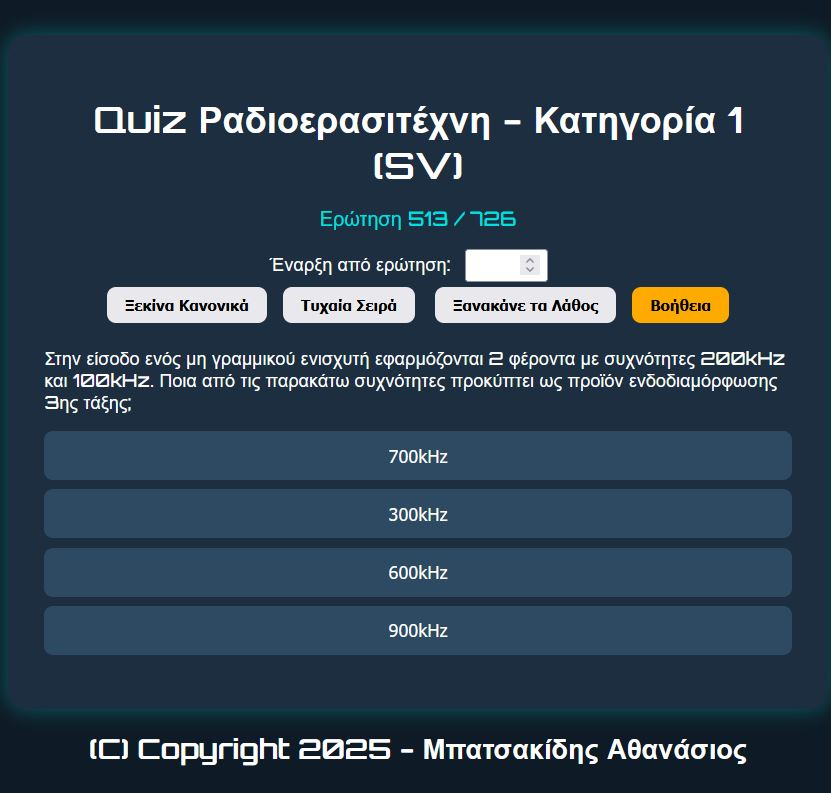

# 📻 Εφαρμογή Ερωτήσεων Ραδιοερασιτέχνη (Κατηγορία 1)

Αυτή η εφαρμογή είναι ένας διαδραστικός quiz player που φορτώνει ερωτήσεις από αρχείο JSON (`erotiseis_sz1a.json`) και επιτρέπει στον χρήστη να απαντά με όμορφο και λειτουργικό περιβάλλον.

## 📦 Περιεχόμενα

- `index.html` – Η βασική ιστοσελίδα που εμφανίζει τις ερωτήσεις και περιλαμβάνει τη λειτουργία εγκατάστασης στην αρχική οθόνη.
- `manifest.json` – Το αρχείο manifest για την υποστήριξη PWA.
- `service-worker.js` – Service Worker για caching και offline λειτουργία.
- `erotiseis_sz1a.json` – Οι ερωτήσεις σε μορφή JSON.
- `README.md` – Αυτό το αρχείο οδηγιών.

## 🚀 Πώς να το τρέξετε

### 1. Μέσω τοπικού εξυπηρετητή (συνιστάται)

Λόγω περιορισμών CORS, πρέπει να ανοίξεις τη σελίδα **μέσω HTTP**, όχι απευθείας με διπλό κλικ.

Έτσι θα φορτωθεί το αρχείο `erotiseis_sz1a.json` χωρίς σφάλματα.

---

### 2. Χωρίς server (μόνο αν έχει ενσωματωμένο το JSON)

Αν δεν θες να χρησιμοποιήσεις τοπικό server, μπορείς να ζητήσεις από τον δημιουργό να σου στείλει έκδοση με ενσωματωμένο JSON μέσα στο `index.html` (χωρίς `fetch()`).

---

## ℹ️ Χαρακτηριστικά

- Τυχαία σειρά ερωτήσεων.
- Επιλογή έναρξης από συγκεκριμένη ερώτηση.
- Υποστήριξη ερωτήσεων με 2, 3 ή 4 επιλογές.
- Εμφάνιση σωστής απάντησης μετά από κάθε επιλογή.
- **Νέο:** Κουμπί **"Βοήθεια"** με οδηγίες χρήσης σε Lightbox (αναδυόμενο παράθυρο).
- **Νέο:** Δυνατότητα εγκατάστασης στην αρχική οθόνη κινητού (PWA) μέσω κουμπιού **"📲 Αποθήκευση ως εφαρμογή"**.
  - Υποστηρίζεται σε Android Chrome και άλλους browsers που επιτρέπουν `beforeinstallprompt`.
  - Λειτουργεί σε πλήρη οθόνη (standalone) και με εικονίδιο εφαρμογής.
  - Διαθέτει offline λειτουργία χάρη στο Service Worker.
- Σχεδίαση με θέμα ραδιοερασιτέχνη (font Orbitron, dark mode).
- Συμβατότητα με ελληνικά.

---

## 📚 Πηγή δεδομένων

Το αρχείο `erotiseis_sz1a.json` προέρχεται από επεξεργασία PDF του Υπουργείου Μεταφορών, με ερωτήσεις θεωρητικών εξετάσεων για την απόκτηση άδειας Ραδιοερασιτέχνη Κατηγορίας 1.

---

## 🛠 Προτάσεις – Βελτιώσεις

- Εμφάνιση βαθμολογίας στο τέλος.
- Κατηγοριοποίηση ερωτήσεων.
- Εισαγωγή ήχων ή χρονομέτρησης.
- Προσθήκη "επαναφοράς" για επανάληψη του quiz.
- Πλοήγηση ανά ενότητα (π.χ. τεχνικά, νομικά).
- Προσθήκη ειδοποίησης push για υπενθύμιση εξάσκησης.

---

## 📄 Screenshot

---

## 📱 Εγκατάσταση στην αρχική οθόνη

1. Άνοιξε την εφαρμογή στον Chrome για Android ή άλλο υποστηριζόμενο browser.
2. Θα εμφανιστεί κουμπί **"📲 Αποθήκευση ως εφαρμογή"**.
3. Πάτησέ το και επιβεβαίωσε την εγκατάσταση.
4. Η εφαρμογή θα εμφανιστεί στην αρχική σου οθόνη με το δικό της εικονίδιο και μπορεί να τρέξει σε πλήρη οθόνη, ακόμα και offline.

---

## 📧 Επικοινωνία

Αν έχεις προτάσεις, προβλήματα ή θέλεις βοήθεια στην προσαρμογή της εφαρμογής, επικοινώνησε με τον δημιουργό.

---

Καλή επιτυχία στις εξετάσεις! 🎓📡
